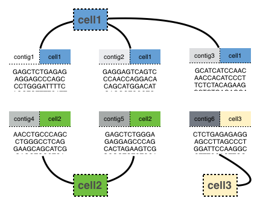
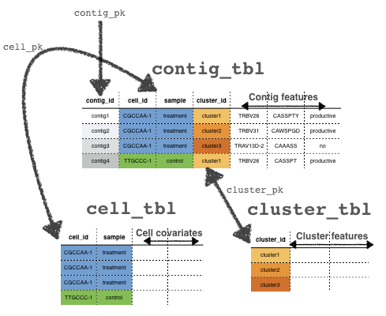

<!-- README.md is generated from README.Rmd. Please edit that file -->

# CellaRepertorium

This package contains methods for clustering and analyzing single cell
RepSeq data, especially as generated by [10X genomics VDJ
solution](https://support.10xgenomics.com/single-cell-vdj).

## Installation

    devtools::install_github('amcdavid/CellaRepertorium')

Requires R \>= 3.5.

## Data requirements and package structure

The fundamental unit this package operates on is the **contig**, which
is a section of contiguously stitched reads from a single **cell**. Each
contig belongs to one (and only one) cell, however, cells generate
multiple contigs.

<!-- -->

Contigs can also belong to a **cluster**. Because of these two
many-to-one mappings, these data can be thought as a series of ragged
arrays. The links between them mean they are relational data. A
`ContigCellDB` object wraps each of these objects as a sequence of three
`data.frames` (well, `tibbles`, actually). `ContigCellDB` also tracks
columns (the primary keys) that unique identify each row in each of
these tables. The `contig_tbl` is the `tibble` containing **contigs**,
the `cell_tbl` contains the **cells**, and the `cluster_tbl` contains
the **clusters**.

The `contig_pk`, `cell_pk` and `cluster_pk` identify the columns that
identify a contig, cell and cluster, respectively. These will serve as
foreign keys that link the three tables together. The tables are kept in
sync so that subsetting the contigs will subset the cells, and clusters,
and vice-versa.

<!-- -->

Of course, each of these tables can contain many other columns that will
serve as covariates for various analyses, such as the CDR3 sequence, or
the identity of the V, D and J regions. Various derived quantities that
describe cells and clusters can also be calculated, and added to these
tables, such as the medoid of a cluster – a contig that minimizes the
average distance to all other clusters.

## Functions

\[a screencap of something interesting?\]

  - `cdhit_ccdb`: An R interface to CDhit, which was originally ported
    by Thomas Lin Pedersen.
  - `fine_clustering`: clustering CDR3 by edit distances (possibly using
    empirical amino acid substitution matrices)
  - `cluster_permute_test`: permutation tests of cluster statistics
  - `pairing_tables`: Generate pairings of contigs within each cell in a
    way that they can be plotted
